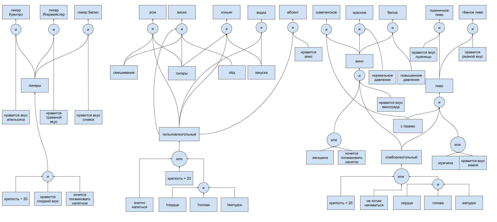

# Отчет по лабораторной работе
## по курсу "Искусственый интеллект"

### Студенты: 

| ФИО       | Роль в проекте                     | Оценка       |
|-----------|------------------------------------|--------------|
| Макаренкова В.М. | Главный эксперт, оформление отчета |          |
| Овечкин В.А | Инженер по знаниям, помощник эксперта |       |
| Кулагин Д.Н.| Главный по реализации, тестирование |      |
| Хренов Г.Н.  | Заполнение базы данных, реализация вывода |          |
| Палёнов П.С.       | Инженер по знаниям, реализация понятий |         |

## Результат проверки

| Преподаватель     | Дата         |  Оценка       |
|-------------------|--------------|---------------|
| Сошников Д.В. |              |               |

> *Комментарии проверяющих (обратите внимание, что более подробные комментарии возможны непосредственно в репозитории по тексту программы)*

## Тема работы

Экспертная система по подбору напитков. Мы подумали, что было бы здорово, если бы, например, в магазине была экспертная система, которая поможет покупателю определиться с выбором напитка из всего их многообразия, будь то алкогольный напиток к застолью или безалкогольный для утоления жажды. На основе ответов пользователя система порекомендует ему наиболее подходящий напиток. Дисклеймер: не поддерживаем злоупотребление алкоголем и всем, что с ним связано. Тема выбрана исключительно с точки зрения полезности на практике нелегкого выбора. Всем здоровья и процветания.

## Концептуализация предметной области

Результаты концептуализации предметной области:
 - выделенные понятия : спиртосодержание, сладость, состояние здоровья, бюджет, еда
 - тип получившейся онтологии - иерархия
 - статические - бюджет,сладость,состояние здоровья,газированность; 
 - каждый участник выбрал напитки, которыми он хотел заниматься, дискуссионно были выделены понятия и онтология, каждый участник занялся поиском информации по своей части и преобразованием ее в предикаты

Приведите графические иллюстрации:

## Принцип реализации системы

Опишите:
 - Какой механизм вывода вы предполагаете использовать и почему
 - Какую систему программирования вы предполагаете использовать и почему
 - Если это имеет смысл, приведите графическую иллюстрацию архитектуры системы. Если система состоит из разных частей (бот, механизм вывода) - опишите принципы интеграции

## Механизм вывода

Опишите, как работает механизм вывода. Наиболее интересные фрагменты кода приведите в отчете.

## Извлечение знаний и база знаний

Опишите, как происходило извлечение знаний, с учётом совместной работы над проектом. Приведите фрагменты представления знаний: дерево И-ИЛИ, наиболее интересные правила. 

## Протокол работы системы

Приведите несколько примеров работы системы, проиллюстрируйте их фрагментами деревьев вывода.

## Выводы

Сформулируйте *содержательные* выводы по лабораторной работе. Чему он вас научила? 
Над чем заставила задуматься? В чём состояли основные сложности в работе? Насколько эффективной получилась командная работа, и какие методы для повышения эффективности командной работы вы использовали (scrum, slack, ...)?

Помните, что несодержательные выводы -
самая частая причина снижения оценки.
